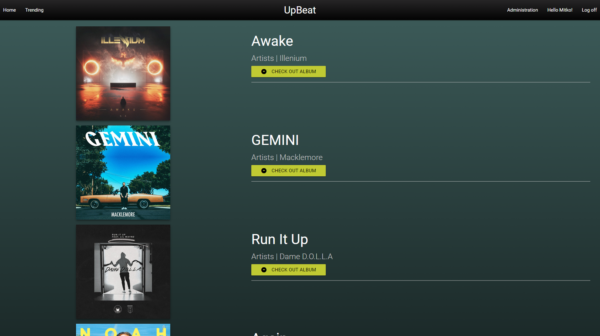
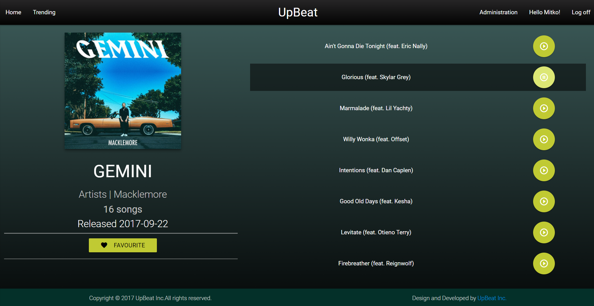
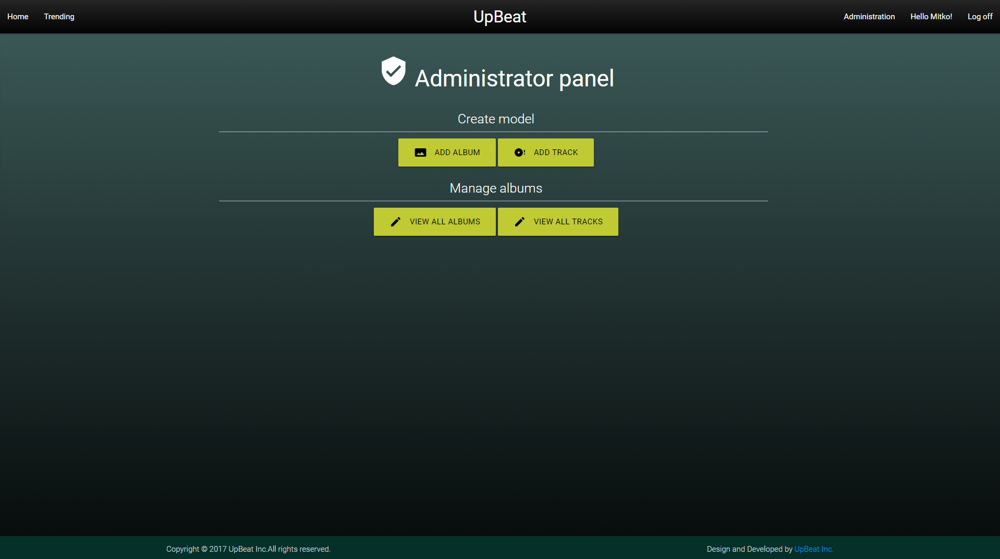
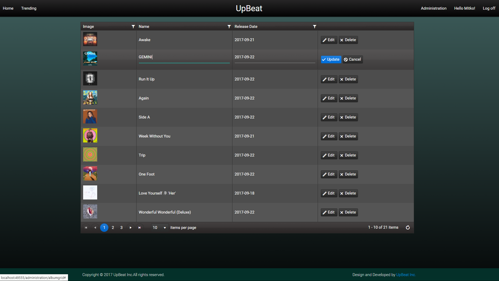
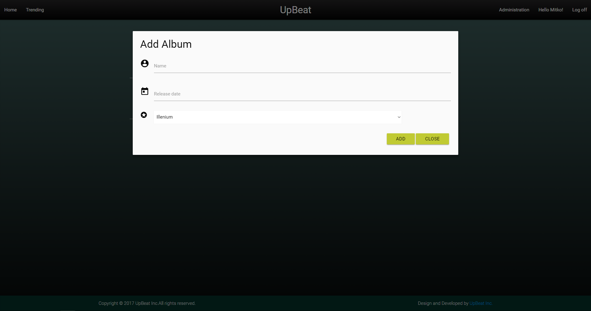

# UpBeat

UpBeat is a ASP.NET MVC application for music lovers.

# Brief project documentation
#### Public part
  - Home
    - Information about the site, what the site is about
    
  - Trending page
    - Listing of the 20 latest albums
    
  - Album details
    - Shows album specific information as well as album track names and previews of the tracks
    
  - About page
    - Information about the creator and contact
#### Authenticated part
 - User account
    - Keeps information about the user's favourite albums
    - Option to change user password
#### Administration part
- Admin panel page
   - Menu containing all administration priviledged actions
   
- Album list page
   - All albums listed, editable and deletable
   
- Track list page
   - All tracks listed, editable and deletable
# Functionality
 - Preview top 20 albums
 - Save favourite album
# Admin functionality
 - Add new track to database
 - Add new album to database
 
 - Edit or delete albums
 - Edit or delete tracks
